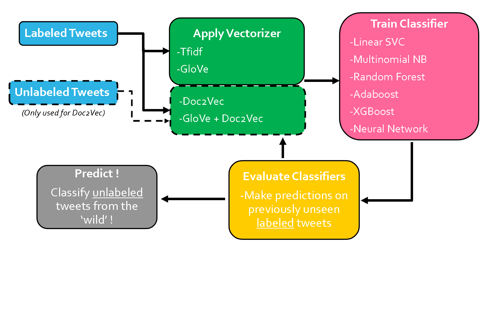
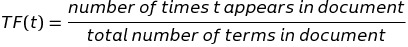
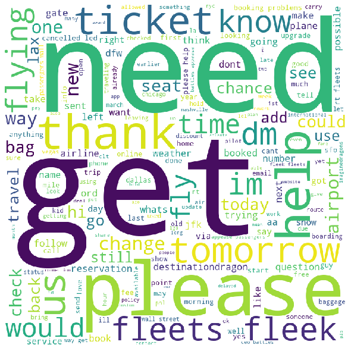

# Leveraging Twitter Data in the Airline Industry: How to More Efficiently Identify Customer Sentiment Using NLP and Machine Learning 
###### Flatiron School Capstone Project

# Abstract

Twitter is one of the world's most popular social media platforms, with roughly 330 million active users worldwide as of 2019 (https://www.oberlo.com/blog/twitter-statistics). Since Twitter allow users to quickly and concisely make statements or ask questions about a specific topic, tweets can be an invaluable information source for companies to learn from customer statements about a product or service.

Text data is being increasingly used to learn about customers through Natural Language Processing (NLP). NLP allows for the numerical representation of text data, which is critical for any machine learning (ML) applications that utilize text data. Today, Twitter is one of the richest publicly available sources of such text data.

This project explores the applications of NLP and ML text classification to Twitter users discussing the airline industry. Specifically, I aim to address the following questions: (1) Which combination of classification algorithm and vectorization method performs best for classifying an airline-related tweet as positive, negative, or neutral? (2) How accurately can this classification be made? (3) Can a large quantity of unlabeled tweets be used in an unsupervised manner to improve classification accuracy for a smaller quantity of labeled tweets?

To answer these questions, I first obtain (1) ~14.6 k airline-related tweets labeled as positive, negative, or neutral (https://www.kaggle.com/crowdflower/twitter-airline-sentiment), and  (2) ~41.5 unlabeled airline-related tweets (https://developer.twitter.com/en). I then develop classification algorithms using multiple NLP vectorization methods (TF-IDF, Doc2Vec, GloVe, GloVe + Doc2Vec) and ML classification algorithms (LinearSVC, Random Forest, Multinomial Naïve Bayes, Adaboost, XGBoost, Neural Network).

A classification accuracy of 89% is achieved using two different techniques: (1) Neural network classifier using GloVe 200d pre-trained word embeddings, and (2) LinearSVC classifier using both GloVe 200d and Doc2Vec embeddings as features.

The addition of ~41.5 k unlabeled tweets while training the unsupervised Doc2Vec embeddings does generally improve classification accuracy when compared to training Doc2Vec on the ~14.6 k labeled tweets alone. However, using Doc2Vec embeddings together with GloVe mean embeddings (GloVe + Doc2Vec) as feature inputs generally does not improve classification accuracy when compared to using GloVe embeddings alone. This is likely due to the fact that GloVe word embeddings are pre-trained on a corpus of tweets several orders of magnitude larger than the dataset used to train Doc2Vec in this study, and therefore the information added by Doc2Vec embeddings is negligible.


# Purpose

Why would we want to apply NLP and machine learning classification to tweets about the airline industry? An efficient and accurate tweet classification system could offer the following advantages:

    -Negative tweets can be identified and addressed by appropriate customer service teams
    
    -Positive tweets can be identified and showcased, used to learn what is 'being done right'
    
    -Questions contained within tweets can be identified and addressed by customer service teams
    
    ...and so on.

##### This project aims to address the following questions using NLP and ML classification techniques:

1. Which combination of classification algorithm and vectorization method performs best for classifying an airline tweet as positive, negative, or neutral?


2. How accurately can this classification be made ?


3. Can a large amount of unlabeled tweets be used to improve classification accuracy for a labeled tweets?


# Project Overview



# Dataset

##### 14.6k airline-related tweets labeled as Positive, Negative, Neutral (February 2015)

https://www.kaggle.com/crowdflower/twitter-airline-sentiment

###### 41.5 k unlabeled airline-related tweets (Mar – Feb 2020)

https://developer.twitter.com/en

See ```twitter_30_day_premium_api_call_all_airlines.ipynb``` in this repository for code used to obtain unlabeled tweets from the Twitter Developer API.

# NLP Vectorization Methods

###### TF-IDF Vectorization

Term Frequency-Inverse Document Frequency (TF-IDF) is a technique used to vectorize words in a corpus of documents. TF-IDF is based on the idea that rare words contain more valuable information for classification than commonly occurring words in the documents. TF-IDF is the product of Term Frequency (TF) and Inverse Document Frequency (IDF), given by the equations below:




###### Doc2Vec

Doc2Vec is an extension of the Word2Vec algorithm, and is used to create a numeric vector representation of a document, regardless of its length. Document embeddings are learned using the distributed memory or the distributed bag of words models.

https://radimrehurek.com/gensim/models/doc2vec.html

###### GloVe

Global Vectors for Word Representation (GloVe) is an unsupervised learning algorithm for generating pre-trained vector representations for words based on co-occurence statistics from a large corpus. For this project, the pre-trained vectors were trained on 2 billion tweets.

https://nlp.stanford.edu/projects/glove/

# ML Algorithms

In this study, I explored the ability of the following machine learning algorithms to accurately predict whether a tweet is positive, negative, or neutral using features generated by the vectorization techniques described above.

##### Linear Support Vector Classification (LinearSVC)

LinearSVC is a supervised algorithm that can be used for classification problems. The algorithm predicts test class labels based on decision boundaries that best separate the classes in n-dimensional feature space, using a linear kernel.

https://scikit-learn.org/stable/modules/generated/sklearn.svm.LinearSVC.html

##### Random Forest

Random Forest is a Decision Tree-based supervised learning ensemble method. Random Forests can be used for classification or regression problems. A Random Forest includes many Decision Trees that each utilize (1) a bootstrap-sampled version of the original dataset and (2) random subsets of the dataset features. In classification problems, each of the Decision Trees in the Random Forest get a 'vote' towards the classification of each example in the test dataset. This method helps counteract the 'overfitting' that can take place when using a single Decision Tree.

https://scikit-learn.org/stable/modules/generated/sklearn.ensemble.RandomForestClassifier.html

##### Multinomial Naive Bayes (Multinomial NB)

Naive Bayes classifiers perform probabilistic classification by applying Bayes' Theorem while also assuming that values for a particular feature are independent of values of the other features. Naive Bayes classifiers are commonly used as baseline algorithms for text classification.

https://scikit-learn.org/stable/modules/generated/sklearn.naive_bayes.MultinomialNB.html

##### AdaBoost

AdaBoost (short for 'Adaptive Boosting') is a Decision-Tree-based supervised learning ensemble method. AdaBoost can be used for classification or regression problems. An AdaBoost algorithm includes many Decision Trees that are 'weak learners' (i.e., each tree has a depth of 1). Unlike a Random Forest, the trees in AdaBoost are trained sequentially, so that examples that were misclassified in previous trees are more heavily weighted in subsequent trees. This method also helps counteract the 'overfitting' that can take place when using a single Decision Tree.

https://scikit-learn.org/stable/modules/generated/sklearn.ensemble.AdaBoostClassifier.html

##### XGBoost

XGBoost (short for eXtreme Gradient Boost) is an extension of the gradient boosting Decision-Tree-based ensemble method. In addition to gradient boosting, XGBoost allows for subsampling of the data at the row, column, and column per split levels, as well as incorporating L1 and L2 regularization.

https://xgboost.readthedocs.io/en/latest/

###### Neural Network

Neural networks are a set of algorithms that can be used for supervised and unsupervised learning tasks. A neural network consists of an input layer, one or more hidden layers, and an output layer. Neural networks have the advantage of being able to perform 'automatic feature extraction' through the weights and activation functions used in the network.

https://keras.io/models/model/


# Obtain
##### NOTE:
See ```twitter_30_day_premium_api_call_all_airlines.ipynb``` in this repository for code used to obtain unlabeled tweets from the Twitter Developer API.

##### Steps:

-Load Kaggle labeled tweets from csv file

-Load unlabeled tweets obtained from Twitter Developer API

-Remove tweets from Kaggle dataset having label confidence score < 1


# Scrub

##### Steps:

-Apply clean_tweet function to Kaggle tweets and unlabeled tweets

    -Lowercase all words
    
    -Remove punctuation, URLs
    
    -Stopwords NOT removed, since tweets are short and I did not want to sacrifice information
    
    -Tweets NOT stemmed or lemmatized (clean_tweets function has option to do so)

-Tokenize tweet text

-Use LabelEncoder to generate integer labels for tweet sentiment classes (positive, negative, neutral)

-Store X (tweet tokens) and y (tweet labels) for use in other notebooks


# Explore

##### Steps:

-Visualize tweet class distribution

-Generate wordclouds for tweet classes

-Generate word frequency distribution plots for tweet classes


###### How many tweets are present in each class in the labeled American Airlines tweets?


###### Positive Tweets Wordcloud


##### FreqDist plot for Positive tweets


###### Negative Tweets Wordcloud


##### FreqDist for negative tweets


###### Neutral Tweets Wordcloud



##### FreqDist for neutral tweets


# Model Part 1: Supervised Tf-idf Classifiers

##### Vectorization: 
TF-IDF

##### Classifiers:
LinearSVC, Random Forest, Multinomial NB, Adaboost, XGBoost, Neural Network

##### Data:

Kaggle labeled tweets

##### Train-Test Split: 
75% Training, 25% Testing

##### Evaluation:
Confusion Matrix, Classification Report, Accuracy Score

##### Interpretation:

Using TF-IDF as a vectorizer, the simple Neural Network performed as the best classifier with 82% accuracy, closely followed by LinearSVC (81%).

Multinomial NB was the worst performing classifier with TF-IDF, at 75% accuracy.


# Model Part 2: Supervised Doc2Vec Classifiers

##### Vectorization: 
Doc2Vec

##### Classifiers:
LinearSVC, Random Forest, Multinomial NB, Adaboost, XGBoost, Neural Network

##### Data:
Kaggle labeled tweets

##### Train-Test Split: 
75% Training, 25% Testing

##### Evaluation:
Confusion Matrix, Classification Report, Accuracy Score

##### Interpretation:

Using doc2vec embeddings trained on the Kaggle labeled data, the neural network is the best performing classifier at 81%. This accuracy is slightly less than that achieved by the neural network using TF-IDF vectorization.

# Model Part 3: Semi-Supervised Doc2Vec Classifiers

##### Vectorization: 
Doc2Vec

##### Classifiers:
LinearSVC, Random Forest, Multinomial NB, Adaboost, XGBoost, Neural Network

##### Data:
Twitter unlabeled tweets & kaggle labeled tweets (for the unsupervised task of generating Doc2Vec embeddings)

Kaggle labeled tweets (for the classification task)

##### Train-Test Split: 
75% Training, 25% Testing

##### Evaluation:
Confusion Matrix, Classification Report, Accuracy Score

##### Interpretation:

The neural network is the best performing classifier using doc2vec embeddings at 82%.

Including the ~41.5k unlabeled tweets while fitting the unsupervised doc2vec model generally seemed to slightly improve classification accuracy as opposed to when only labeled Kaggle tweets were used for doc2vec.

# Model Part 4: GloVe Word Embedding Classifiers - 100d

##### Vectorization: 
GloVe embeddings (100d per word, pre-trained on corpus of 2 billion tweets)

Mean embeddings are then calculated using the words present in each tweet

##### Classifiers:
LinearSVC, Random Forest, Multinomial NB, Adaboost, XGBoost, Neural Network

##### Data:
Kaggle labeled tweets

##### Train-Test Split: 
75% Training, 25% Testing

##### Evaluation:
Confusion Matrix, Classification Report, Accuracy Score

##### Interpretation:

Using GloVe 100d mean embeddings as input to classification models results in marked improvement over the TF-IDF and Doc2vec methods. The neural network and LinearSVC classifiers both achieved 87% classification accuracy.

# Model Part 5: GloVe Embedding Classifiers - 200d

##### Vectorization: 
GloVe embeddings (200d per word, pre-trained on corpus of 2 billion tweets)

Mean embeddings are then calculated using the words present in each tweet

##### Classifiers:
LinearSVC, Random Forest, Multinomial NB, Adaboost, XGBoost, Neural Network

##### Data:
Kaggle labeled tweets

##### Train-Test Split: 
75% Training, 25% Testing

##### Evaluation:
Confusion Matrix, Classification Report, Accuracy Score

##### Interpretation:

Increasing the dimesions for GloVe from 100d to 200d resulted in an increase in classification accuracy for LinearSVC (88%), Multinomial NB (71%), and neural network (89%). 

# Model Part 6: GloVe + d2v Classifiers

##### Vectorization: 

Concatenation of:

- GloVe embeddings (200d per word, pre-trained on corpus of 2 billion tweets)

- Doc2Vec

##### Classifiers:
LinearSVC, Random Forest, Multinomial NB, Adaboost, XGBoost, Neural Network

##### Data:
Twitter unlabeled tweets & kaggle labeled tweets (for the unsupervised task of generating Doc2Vec embeddings)

Kaggle labeled tweets (for the classification task)

##### Train-Test Split: 
75% Training, 25% Testing

##### Evaluation:
Confusion Matrix, Classification Report, Accuracy Score


<div>
<table border="1" class="dataframe">
  <thead>
    <tr style="text-align: right;">
      <th></th>
      <th>Classifier</th>
      <th>Tfidf Accuracy</th>
      <th>Supervised d2v Accuracy</th>
      <th>Semi-Supervised d2v Accuracy</th>
      <th>GloVe Accuracy - 100d</th>
      <th>GloVe Accuracy - 200d</th>
      <th>GloVe + d2v Accuracy</th>
    </tr>
  </thead>
  <tbody>
    <tr>
      <td>0</td>
      <td>Linear SVC</td>
      <td>0.81</td>
      <td>0.77</td>
      <td>0.81</td>
      <td>0.86</td>
      <td>0.89</td>
      <td>0.89</td>
    </tr>
    <tr>
      <td>1</td>
      <td>Random Forest</td>
      <td>0.8</td>
      <td>0.75</td>
      <td>0.74</td>
      <td>0.83</td>
      <td>0.83</td>
      <td>0.82</td>
    </tr>
    <tr>
      <td>2</td>
      <td>Multinomial Naive Bayes</td>
      <td>0.75</td>
      <td>0.70</td>
      <td>0.70</td>
      <td>0.70</td>
      <td>0.71</td>
      <td>0.71</td>
    </tr>
    <tr>
      <td>3</td>
      <td>AdaBoost</td>
      <td>0.79</td>
      <td>0.76</td>
      <td>0.76</td>
      <td>0.83</td>
      <td>0.83</td>
      <td>0.83</td>
    </tr>
    <tr>
      <td>4</td>
      <td>XGBoost</td>
      <td>0.8</td>
      <td>0.77</td>
      <td>0.78</td>
      <td>0.85</td>
      <td>0.86</td>
      <td>0.86</td>
    </tr>
    <tr>
      <td>5</td>
      <td>Neural Network</td>
      <td>0.82</td>
      <td>0.81</td>
      <td>0.83</td>
      <td>0.87</td>
      <td>0.89</td>
      <td>0.88</td>
    </tr>
  </tbody>
</table>
</div>

##### Interpretation

Including doc2vec embeddings with GloVe mean word embeddings slightly improves accuracy for some classifiers (LinearSVC - 89%, AdaBoost - 83%, XGBoost - 87%), and decreases accuracy for others (Random Forest - 81%, neural network - 88%).

##### Summary barplot of classifier accuracy


###### Confusion matrix plot for best performing model


# Conclusions

1) The best classification accuracy achieved with respect to whether an airline-related tweet is positive, negative, or neutral is 89%, using either of the following methods:

    -Simple Neural Network Classifier using GloVe 200d pre-trained mean word embeddings
    
    -LinearSVC using Glove 200d pre-trained mean word embeddings and Doc2Vec embeddings

2) Positive tweets often contain words of gratitude or compliments:

    -'thanks', 'thank', 'great', 'love', 'service', 'customer', 'best', 'guys', 'much', 'awesome', 'crew'

3) Negative tweets often contain words referring to a cancellation or some kind of time delay:

    -'cancelled', 'service', 'hours', 'hold', 'customer', 'time', 'help', 'plane', 'delay'
    
4) Neutral tweets often contain words signaling a request for information or answer to a question:

    -'get', 'please', 'help', 'need', 'us', 'thanks', 'tomorrow', 'dm', 'would', 'flying'

5) Some aspects of tweet language are very difficult for NLP/ML classification:

    -Sarcasm:
    
    E.g. "@VirginAmerica husband and I ordered three drinks via my screen and they never came. Awesome!"
    
    -Negative tweets that contain some positive words:
    
    E.g. "@JetBlue I appreciate the credit for my troubles but the lack of personal response troubles me."

# Recommendations

1) Airline companies should incorporate a twitter sentiment classifier into their customer service plans to more efficiently address customer concerns, questions, opinions, compliments, etc.

2) NLP can be used to identify words most commonly appearing in positive, negative, and neutral tweets about an airline company. This can provide insight into what a company is doing right and wrong from a customer's perspective.
    
    -Positive: words of gratitude, good customer service
    
    -Negative: words concerning time waiting, delayed/canelled flights, bad customer service
    
    -Neutral: requests for information, questions

3) Twitter sentiment classifiers are most effective when using GloVe pre-trained word vectors. Since GloVe vectors are trained on 2 billion tweets, they capture more information than can be obtained by training a Doc2Vec model from scratch on a smaller corpus of unlabeled tweets (~41.5k unlabeled tweets used in this study).